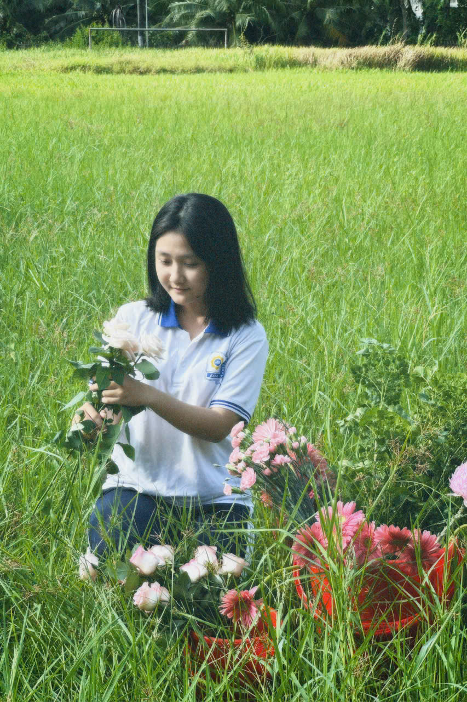

<!DOCTYPE html>
<html lang="en">
<head>
    <meta charset="UTF-8">
    <meta name="viewport" content="width=device-width, initial-scale=1.0">
</head>
<body>
    <table width="60%" align="center" border="1" cellspacing="0" cellpadding="10">
        <tr>
            <td colspan="2" align="center">
                
            </td>
        </tr>
        <tr>
            <tr>
            <td colspan="2" align="center">
                <iframe width="100%" height="315" src="790695121580062924.mp4" frameborder="0" allowfullscreen></iframe>
            </td>
        </tr>
            </td>
        </tr>
        <tr>
            <td colspan="2">
                <h2>Tóm tắt tiểu sử Ngọc Ngân</h2>
                <ul>
                    <li>Họ tên: Phạm Ngọc Ngân</li>
                    <li>Ngày sinh: 05/02/2007</li>
                    <li>Quê quán: Bình Đại, Bến Tre</li>
                    <li>Cung hoàng đạo: Bảo Bình</li>
                    <li>Học tại: Trường THPT Chuyên Bến Tre</li>
                    <li>Sở thích: uống trà sữa có trân châu, củ năng, bánh plan</li>
                    <li>Ước mơ: có một cuộc sống bình yên</li>
                </ul>
            </td>
        </tr>
        <tr>
            <td colspan="2">
                <h2>Giới thiệu bản thân</h2>
                

                    Chào mọi người! Sau đây em xin tự giới thiệu về bản thân mình. Em tên là Phạm Ngọc Ngân. 
                    Em sinh ra và lớn lên tại Bến Tre. Hiện nay em đang theo học tại trường THPT Chuyên Bến Tre. 
                    Em là học sinh lớp 12 Lý. Mẹ em là một giáo viên tiểu học. Mẹ rất hiền dịu và xinh xắn. 
                    Mẹ em rất đảm đang, vừa giỏi việc nhà vừa giỏi việc trên trường. Gia đình em còn một người em trai. 
                    Em trai em hiện đang học lớp 8. Anh trai em rất hiền và tốt bụng. Em rất tự hào khi có người em như vậy. 
                    Em rất tích cực trong việc tổ chức các hoạt động tình nguyện, chung tay xây dựng một môi trường lành mạnh, xanh, sạch, đẹp.
                

            </td>
        </tr>
    </table>
</body>
</html>
